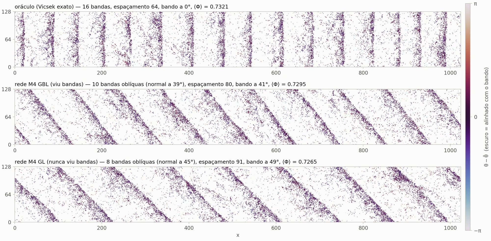

# Vicsek + GNN: uma rede neural aprende a regra de um bando

**[Site com os resultados e gráficos interativos](https://SEU-USUARIO.github.io/vicsek-gnn/)** · C · SLURM · Python · PyTorch

Treinei redes neurais em grafo (GNNs) para imitar, um passo de cada vez, as partículas do modelo de Vicsek. Depois tirei a regra verdadeira e deixei a rede conduzir o sistema sozinha, em malha fechada. A pergunta era se o comportamento coletivo reaparece: ordem, flutuações e as bandas densas que atravessam o sistema. Reaparece, inclusive numa rede treinada sem nunca ter visto uma banda.



*Configuração no fim de 130 mil passos (ruído vetorial, ρ = 1). Em cima, o modelo exato; no meio, a rede treinada com gás, bandas e líquido; embaixo, a rede treinada só com gás e líquido.*

## Resultados

| Etapa | Resultado |
| --- | --- |
| **Um passo** | A melhor GNN (M4, com peso aprendido por distância) erra a direção do próximo passo por 0,5° a 1°; com média simples (M3), por 1° a 2°. Sem vizinhos, o erro é de 14° a 35°; uma rede densa com as 8 vizinhas mais próximas fica em 5° a 8°. Teste em 40.960 partículas por estado (gás, bandas, líquido) e por tipo de ruído. |
| **O que a rede aprendeu** | Ninguém informou o raio de interação. O peso aprendido para cada distância cai de 90% para 10% entre d = 0,97 e 1,02; a regra verdadeira corta em R = 1. |
| **Malha fechada (64 × 64)** | Rodando sozinha, a rede fica a menos de 2σ do modelo exato no parâmetro de ordem em 9 de 10 condições; nas fases ordenadas a diferença é de 0,01% a 0,3%. O único desvio claro é no ruído vetorial com ρ = 1: +1,1% (3,9σ). |
| **Bandas (1024 × 128)** | As bandas andam a 0,451 por passo nas redes e a 0,450 no modelo exato. A densidade do gás e a forma das bandas também batem; o que muda é o padrão (número e orientação das bandas). |
| **Fora da distribuição** | Uma rede treinada só com gás e líquido forma bandas no mesmo limiar do modelo exato, com o mesmo perfil e a mesma velocidade. |

Os números vêm de `runs/resultados.tsv`, `rollouts/rollouts.tsv`, `bandas_GL/figuras/resumo1024_oraculo_GBL_GL.tsv` e `varredura64_GL/resumo64_oraculo_GBL_GL.tsv`.

## Como funciona

1. **Simulação** (`sim/`, C). Modelo de Vicsek com lista de células e contorno periódico, dois tipos de ruído (angular e vetorial). Validado contra uma implementação em Python: alinhamento igual a 10⁻⁶ rad, vizinhança idêntica e teste KS da distribuição do ruído.
2. **Campanha no cluster** (`cluster/`, SLURM). 1.326 simulações em job arrays, retomáveis pela semente: localização das transições, mapa de fases em densidade e dados de treino (gás, bandas e líquido, 10 sementes por estado).
3. **Dados em grafo** (`python/prep_dataset.py`). Cada partícula focal vira uma estrela com as vizinhas até d = 2, no referencial dela. Treino, validação e teste separados por semente (`vicsek-dados/bloco2_indice.txt`).
4. **Treino** (`treino.py`). Cinco arquiteturas aprendidas, da rede que ignora as vizinhas (M1) às GNNs com peso por distância (M4) e atenção (M5), mais o oráculo exato (M0) e o piso da cabeça (M0h). A saída é a distribuição inteira do próximo ângulo (direção + histograma simétrico de 100 bins), e a perda é comparada com a da distribuição exata. Sem PyTorch Geometric: grafos em CSR e agregação com `index_add`.
5. **Malha fechada** (`rollout.py`). Simulador em PyTorch na GPU com a mesma regra do código em C; a rede substitui a regra, e o modelo exato roda no mesmo código como controle.
6. **Análise** (`analise.py`, `tabela.py`, `bandas_analise.py`, `bandas1024.py`, `bandas64.py`, `vel64.py`). Parâmetro de ordem, flutuações, cumulante de Binder, detecção de bandas por Fourier 2D, kimógrafos e perfis.

## Estrutura

```
vicsek-gnn/
├── sim/                  simulador em C (FastVicsek.c, Makefile, README com o formato dos arquivos)
├── python/               leitura dos binários, validação, teoria do ruído, preparação do dataset
├── cluster/              camada SLURM: submissão, grades de parâmetros, progresso, Φ e χ
├── pc/                   mini-campanha para rodar no PC
├── treino.py             modelos M0 a M5, treino e avaliação
├── rollout.py            malha fechada na GPU (rede ou modelo exato)
├── rodar_*.sh            execuções completas (baselines, GNNs, rede treinada sem bandas)
├── rollout_densidades.sh rede × modelo exato em várias densidades
├── analise.py, tabela.py, bandas*.py, vel64.py, checar_wd.py   análise e figuras
├── runs/                 pesos treinados (modelo.pt), métricas e figuras por modelo
├── rollouts/, bandas/, bandas_GL/, varredura64_GL/            tabelas e figuras da malha fechada
└── docs/                 site do projeto (GitHub Pages)
```

## Como reproduzir

```bash
# 1. simulador
cd sim && make && make test && cd ..

# 2. campanha no cluster (grades já geradas em cluster/grid_*.txt)
cd cluster && ./submit.sh 0 && ./status.sh 0 && cd ..

# 3. dataset em grafo, a partir dos snapshots do bloco 2A
python3 python/prep_dataset.py <pasta_dos_snapshots> vicsek-dados/bloco2_indice.txt <pasta_do_dataset>

# 4. treino (os pesos já estão em runs/*/modelo.pt; dá para pular esta etapa)
bash rodar_baselines.sh <pasta_do_dataset>
bash rodar_gnns.sh <pasta_do_dataset>
python3 treino.py --dados <pasta_do_dataset> --ruido vetorial --modelo m4 --estados GL --epocas 60 --tag e60

# 5. malha fechada: rede e modelo exato nas mesmas condições
bash rollout_densidades.sh
python3 rollout.py --modelo runs/vetorial_m4_hist_GL_e60 --robs 1.2 --L 1024 --Y 128 --rho 1 \
  --init alinhado --transiente 100000 --passos 30000 --quadros 100 --saida bandas_GL
python3 rollout.py --oraculo vetorial --eta 0.55 --L 1024 --Y 128 --rho 1 \
  --init alinhado --transiente 100000 --passos 30000 --quadros 100 --saida bandas

# 6. figuras e tabelas
python3 tabela.py
python3 bandas1024.py bandas bandas_GL
```

Requisitos: Python 3.10 ou mais novo com `numpy`, `scipy`, `matplotlib` e `torch` (`requirements.txt`), um compilador C e, para a malha fechada na caixa grande, uma GPU com CUDA (usei uma GTX 1650 de 4 GB).

Os dados brutos (snapshots, dataset em grafo e trajetórias, alguns GB) não estão no repositório; os scripts acima os regeneram a partir das sementes.

## Limitações

- A maioria das comparações usa uma semente por ponto, e as flutuações (χ) ainda não têm barra de erro.
- Um desvio em aberto: ruído vetorial, ρ = 1, caixa 64 × 64 (+1,1%, 3,9σ). Na caixa grande a diferença é de −0,4%.
- Nas bandas, o número e a orientação diferem do modelo exato; falta separar seleção de padrão de efeito sistemático.
- Todos os dados são sintéticos, gerados pelo próprio modelo.

## Autor

Leo Santos Lopes, doutorado em física computacional (UFMG).

## English summary

Graph neural networks were trained to imitate the Vicsek model one step at a time and then run in closed loop in place of the true rule. The best network predicts the next heading within 0.5–1°, recovers the interaction radius R = 1 without being told, matches the exact model's order parameter within 2σ in 9 of 10 conditions, and reproduces traveling bands with the same speed (0.451 vs 0.450 per step), including a network trained only on gas and liquid states that never saw a band. Code: C (simulation), bash/SLURM (cluster campaign), Python and PyTorch (training, closed-loop simulator, analysis).
